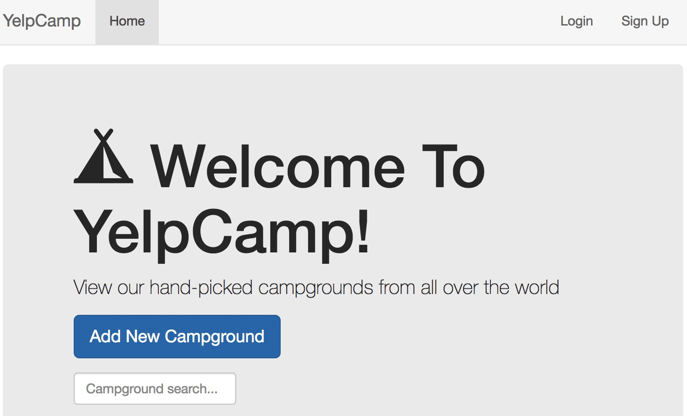
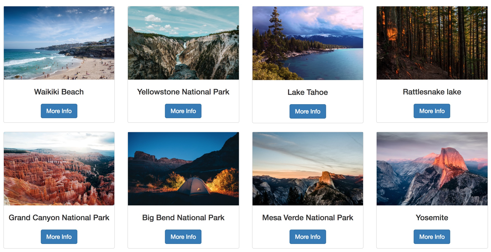
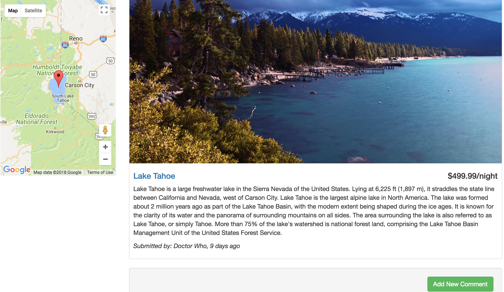
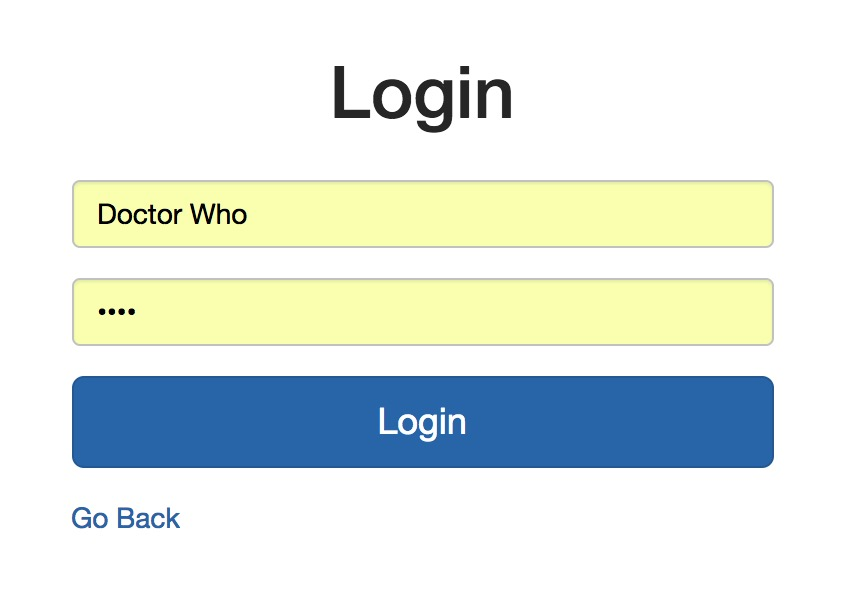
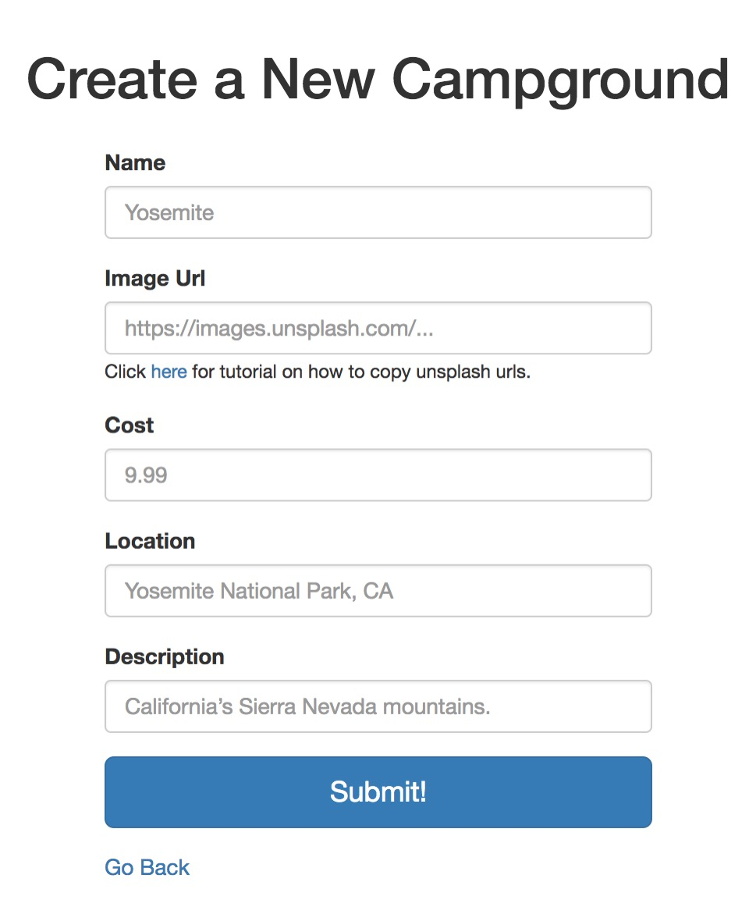

# YelpCamp

### Deployed on Heroku: https://fathomless-caverns-24481.herokuapp.com

Full-stack | Node.js | Express | Bootstrap | jQuery | MongoDB | RESTful | Git

• A yelp-like web app based on Node.js and Express for people to share campgrounds around the world.

• Designed RESTful APIs for CRUD operations for campgrounds & comments, and authentication for users.

• The website is responsive and mobile-friendly. Campground locations are shared using Google Maps API.

• Used MongoDB as database. Maintained data in cloud database mLab.

